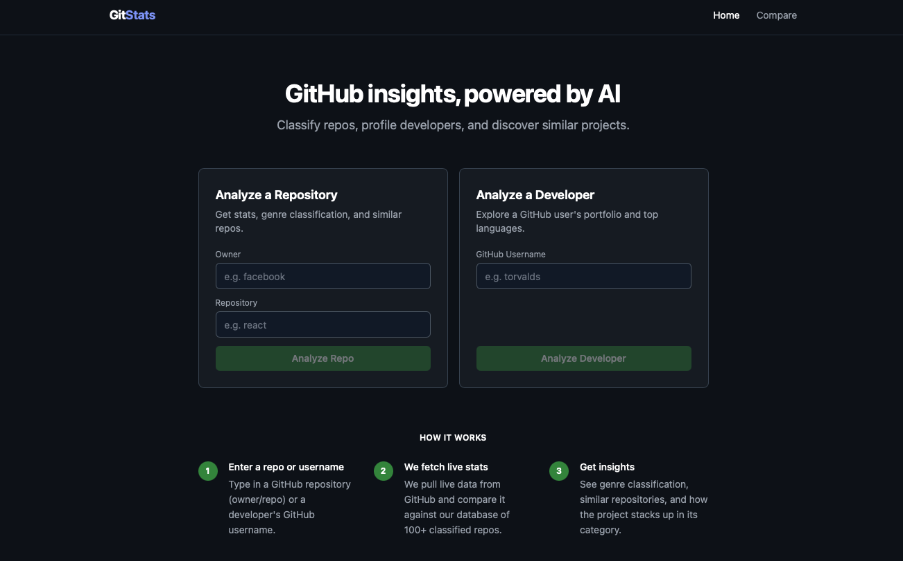
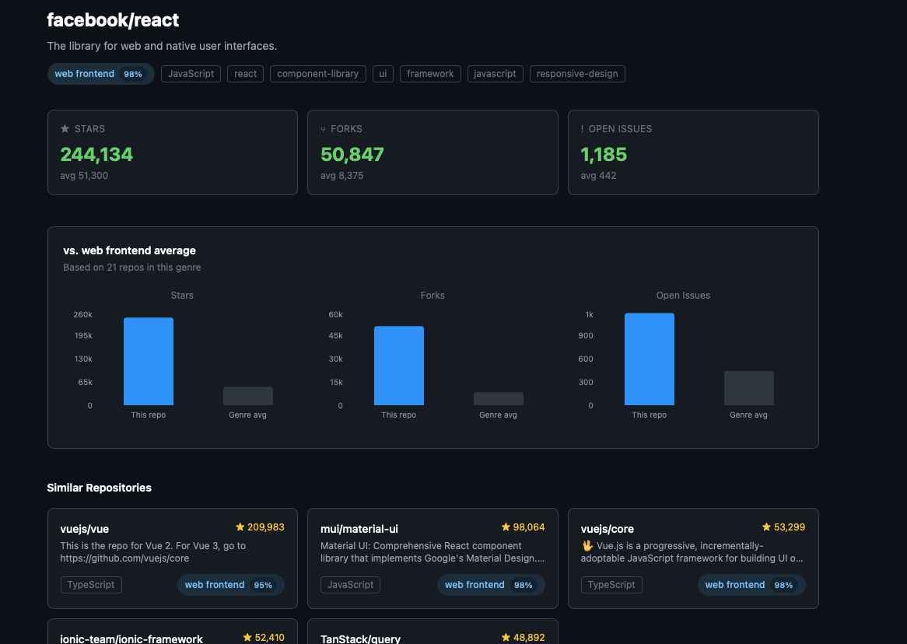
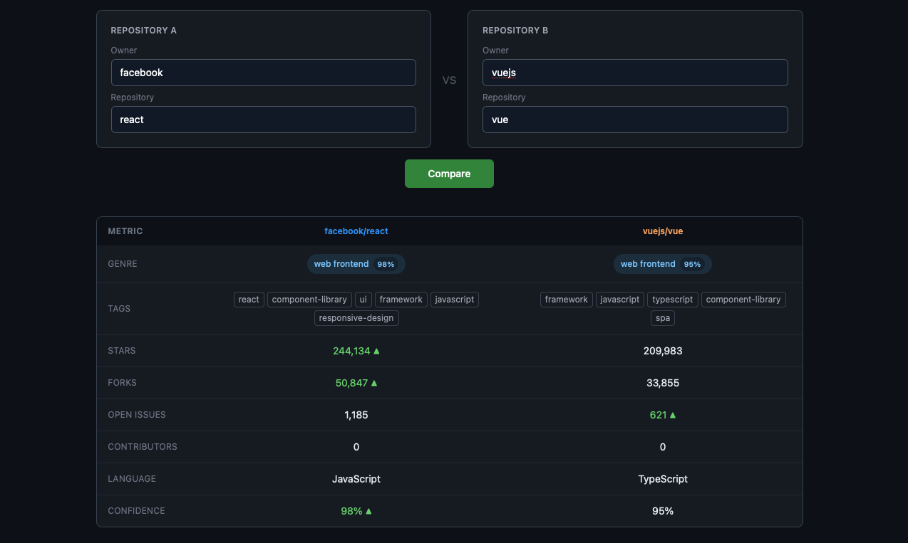

# GitStats — GitHub Analytics Powered by AI

> Analyze any GitHub repository or developer profile, get AI-powered genre classification,
> and discover similar projects — all compared against a database of 100+ classified repos.

## Screenshots





## Features

- **Repo Dashboard** — Live stats (stars, forks, issues) compared against genre averages
- **AI Classification** — Claude AI classifies every repo into a genre with confidence score and tags
- **Similar Repos** — Discover related projects based on genre and tags
- **Developer Profile** — Analyze any GitHub user's portfolio, languages, and top repos
- **Repo Comparison** — Compare two repositories head to head with visual charts
- **100+ Repo Database** — Precomputed stats across 10 genres for instant benchmarking

## Tech Stack

**Backend**
- FastAPI + Python
- SQLAlchemy + asyncpg + PostgreSQL (Supabase)
- Anthropic Claude API (claude-haiku) for repo classification
- GitHub REST API with OAuth for 5000 req/hour

**Frontend**
- React + Vite + Tailwind CSS
- Recharts for data visualization
- React Router for navigation

## Getting Started

### Prerequisites

- Python 3.11+
- Node.js 18+
- A GitHub OAuth App (for API rate limits)
- Anthropic API key
- Supabase project (free tier)

### Docker Setup

```bash
docker compose build
docker compose up
```

If you build and run the docker containers locally with the above two commands, you can skip the following backend and frontend setup steps. You will still need to fill in the environment variables.

### Backend Setup

```bash
cd backend
python -m venv venv
source venv/bin/activate  # Windows: venv\Scripts\activate
pip install -r requirements.txt
cp .env.example .env
# Fill in your API keys in .env
uvicorn main:app --reload
```

### Frontend Setup

```bash
cd frontend
npm install
cp .env.example .env
# Fill in VITE_API_URL and VITE_GITHUB_CLIENT_ID
npm run dev
```

### Environment Variables

**backend/.env**
```
GITHUB_CLIENT_ID=
GITHUB_CLIENT_SECRET=
GITHUB_TOKEN=
SUPABASE_URL=
SUPABASE_KEY=
ANTHROPIC_API_KEY=
SECRET_KEY=
```

**frontend/.env**
```
VITE_API_URL=
VITE_GITHUB_CLIENT_ID=
```

## How It Works

1. **Scraping** — The backend scrapes GitHub for repositories with significant stars using the GitHub Search API
2. **Classification** — Each repo's name, description, readme, language and topics are sent to Claude AI which assigns a genre and tags
3. **Storage** — Classified repos are stored in PostgreSQL via Supabase for fast comparisons
4. **Analysis** — When you look up a repo, it fetches live data from GitHub and compares it against precomputed genre averages from the database

## API Endpoints

| Method | Endpoint | Description |
|--------|----------|-------------|
| `POST` | `/api/scrape/start` | Start scraping GitHub for repos by genre |
| `GET`  | `/api/stats/repo/{owner}/{repo}` | Get stats + classification + genre comparison for a repo |
| `GET`  | `/api/stats/developer/{username}` | Get developer profile and top repos |
| `GET`  | `/api/repos/similar/{owner}/{repo}` | Find similar repos by genre |
| `GET`  | `/api/repos/search?q=query` | Search repos in the database |
| `POST` | `/api/admin/reclassify` | Reclassify repos with missing genre data |
| `GET`  | `/health` | Health check |

## Project Structure

```
gitstats/
├── backend/
│   ├── main.py          # FastAPI routes
│   ├── scraper.py       # GitHub API scraping
│   ├── classifier.py    # Claude AI classification
│   ├── database.py      # DB models and queries
│   ├── genres.py        # Genre and tag definitions
│   └── requirements.txt
└── frontend/
    └── src/
        ├── pages/
        │   ├── Home.jsx
        │   ├── RepoDashboard.jsx
        │   ├── DevDashboard.jsx
        │   └── Compare.jsx
        └── components/
            ├── StatCard.jsx
            ├── GenreTag.jsx
            └── SimilarRepos.jsx
```

## Contributing

Pull requests welcome. For major changes please open an issue first.

## License

MIT
